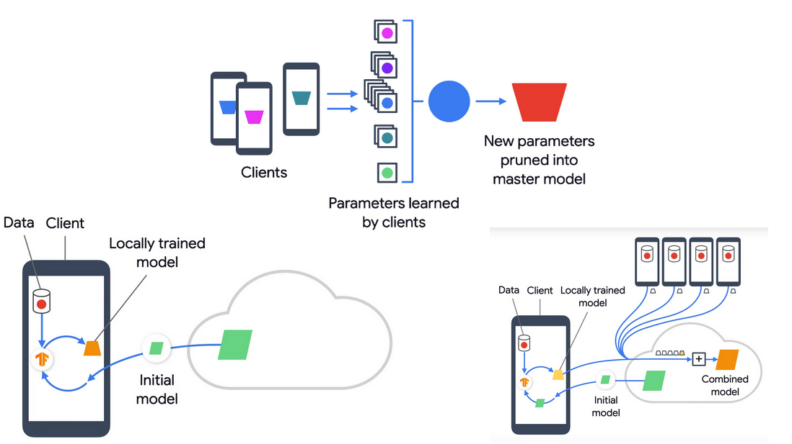
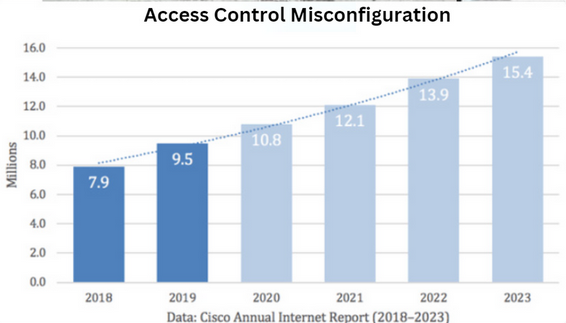

# Industriai-hackothon-IITM
 

## Problem Statment 
### Problem Statement 3: Secure Cloud-Native Solutions for Financial Institutions
**Track**: Cloud-Native Security Frameworks

**Challenge**: Develop innovative and secure cloud-native solutions tailored to the evolving needs of financial
institutions. The goal is to ensure robust data privacy, integrity, and compliance within the
dynamic cloud environment while enabling scalability and flexibility

**Key Areas of Focus**:
- Data Security
- Compliance
- Threat Mitigation
- Resilience and Scalability
- Ease of Implementation
- Flexibility

## Working progress
An UI has been created for First round . For backend, we will be training a model that determines whether a person is authenticated to access the file and authorize for any changes based on the file description .

## Workflow

An innovative, multi-layered solution designed to integrate seamlessly with existing cloud systems, ensuring enhanced **data privacy**, **scalability**, and **transparency** with minimal disruption.

## Features Planning to implement 

- **Federated Learning**  
  Decentralized training keeps data local, protecting user privacy while improving collaborative learning models.
  

- **Homomorphic Encryption**  
  Securely processes encrypted data without decryption, preserving privacy during computations.

- **Reinforcement Learning**  
  Dynamically adapts access policies based on real-time behavior and patterns.

- **Blockchain Integration**  
  Ensures tamper-proof logging, enhancing auditability and strengthening overall security.

## Workflow

1. **Data Collection**  
   Distributed data is collected across multiple devices without exposing sensitive information.

2. **Federated Training**  
   Local training aggregates insights while keeping raw data decentralized.

3. **Encryption and Processing**  
   Homomorphic encryption allows secure computations on encrypted data.

4. **Dynamic Policy Adaptation**  
   Reinforcement learning refines access control policies based on behavioral feedback.

5. **Secure Audit Logging**  
   All access events are logged using blockchain for immutable and transparent audit trails.
## Problems
### Access control
Access control misconfigurations are a significant cybersecurity concern, often leading to unauthorized access and data breaches. In 2023, misconfigurations contributed to a 78% surge in data breaches compared to the previous year.  Additionally, cloud misconfigurations accounted for 15% of initial attack vectors in security breaches, ranking as the third most common cause.  These statistics highlight the critical need for organizations to implement robust access control measures and regularly audit their configurations to safeguard against potential threats.

**research**:
1. [Cloud security issues](https://www.strongdm.com/blog/cloud-security-statistics?utm_source=chatgpt.com)
2. [impact on security misconfigration](https://gitprotect.io/blog/the-impact-of-security-misconfigurations-on-data-breach-incidents/?utm_source=chatgpt.com)
 
 ### Finance sector - cloud computing
 Current Challenge in Finance Sector
Traditional Access Control Mechanisms (DAC, MAC, ABAC, RBAC) in Cloud Computing face significant challenges such as data privacy ,scalability, and addressing centralized vulnerabilities, which leads to single points of failure. Additionally, these models often lack the transparency and auditability needed for regulatory compliance (e.g., PCI DSS, GDPR). These limitations highlight the critical need for dynamic, flexible access control systems that can adapt to evolving security threats and compliance requirements in cloud environments.

## Solutions

Our solution addresses the pressing challenges of secure access control and data privacy in cloud-native environments, particularly for financial institutions. By integrating federated learning, homomorphic encryption, reinforcement learning, and blockchain, we ensure a multi-layered approach to security. Federated learning enables decentralized training, safeguarding sensitive data while improving collaborative insights. Homomorphic encryption ensures computations are performed securely on encrypted data, eliminating the need for decryption. Reinforcement learning dynamically adapts access policies based on real-time behavior, enhancing flexibility and responsiveness. Blockchain ensures immutable logging, providing transparency and tamper-proof audit trails.

This innovative system not only mitigates risks of unauthorized access and centralized vulnerabilities but also aligns with regulatory standards such as PCI DSS and GDPR. The decentralized and adaptable architecture fosters scalability and resilience while ensuring robust data integrity, privacy, and compliance. Designed for seamless integration into existing cloud frameworks, the solution delivers enhanced security with minimal disruption, empowering financial institutions to securely navigate the evolving cloud landscape.

## UI works 

